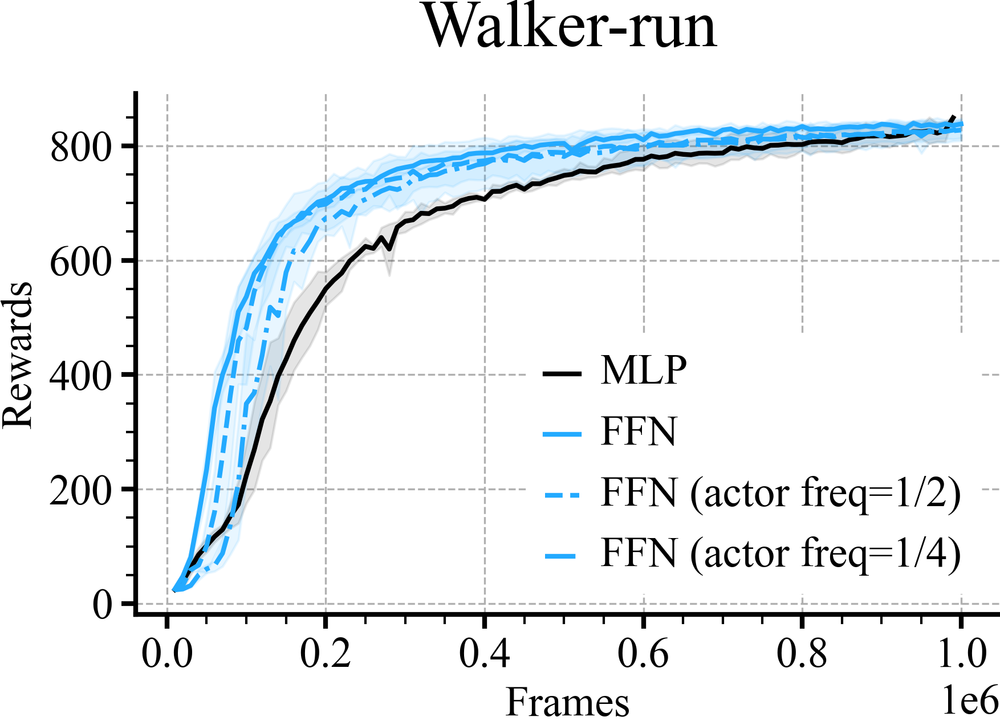
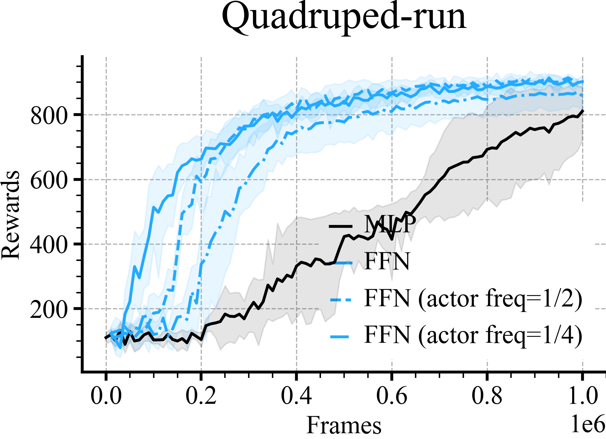

# MUJOCO Comparisons
```python
loader = ML_Logger(prefix="/model-free/model-free/sac_dennis_rff/dmc/")
```
```python
def plot_line(path, color, label, x_key, y_key, linestyle='-'):
    mean, low, high, step, = loader.read_metrics(f"{y_key}@mean",
                                                 f"{y_key}@16%",
                                                 f"{y_key}@84%",
                                                 x_key=f"{x_key}@min", path=path, dropna=True)
    plt.xlabel('Frames', fontsize=18)
    plt.ylabel('Rewards', fontsize=18)

    plt.plot(step.to_list(), mean.to_list(), color=color, label=label, linestyle=linestyle)
    plt.fill_between(step, low, high, alpha=0.1, color=color)
```
```python
for (e, (env, scale)) in enumerate(tqdm(zip(envs, scales), desc="env-scales")):

    if e % 4 == 0:
        r = doc.table().figure_row()

    plot_line(path=f"3_layer/mlp/{env}/**/metrics.pkl", color='black', label='MLP', x_key='frames',
              y_key="eval/episode_reward/mean")

    plot_line(path=f"2_layer/lff/{env}/alpha_tune/scale-{scale}/**/metrics.pkl", color=colors[0], label=f'FFN',
              x_key='frames', y_key="eval/episode_reward/mean")

    linestyles = ['dashed', '-.']
    for (j, update_freq) in enumerate([2,4]):
        plot_line(path=f"actor_delay/lff/{env}/alpha_tune/scale-{scale}/actor_update_freq-{update_freq}/**/metrics.pkl", color=colors[0],
                  label=f'FFN (actor freq=1/{update_freq})',
                  x_key='frames', y_key="eval/episode_reward/mean", linestyle=linestyles[j])

    plt.title(env)
    plt.legend()
    plt.tight_layout()
    [line.set_zorder(100) for line in plt.gca().lines]
    [spine.set_zorder(100) for spine in plt.gca().collections]
    r.savefig(f'{os.path.basename(__file__)[:-3]}/{env}.png', dpi=300, zoom=0.3, title=env)
    plt.savefig(f'{os.path.basename(__file__)[:-3]}/{env}.pdf', dpi=300, zoom=0.3)
    plt.close()
```

| **Walker-run** | **Quadruped-run** |
|:--------------:|:-----------------:|
|  |  |
