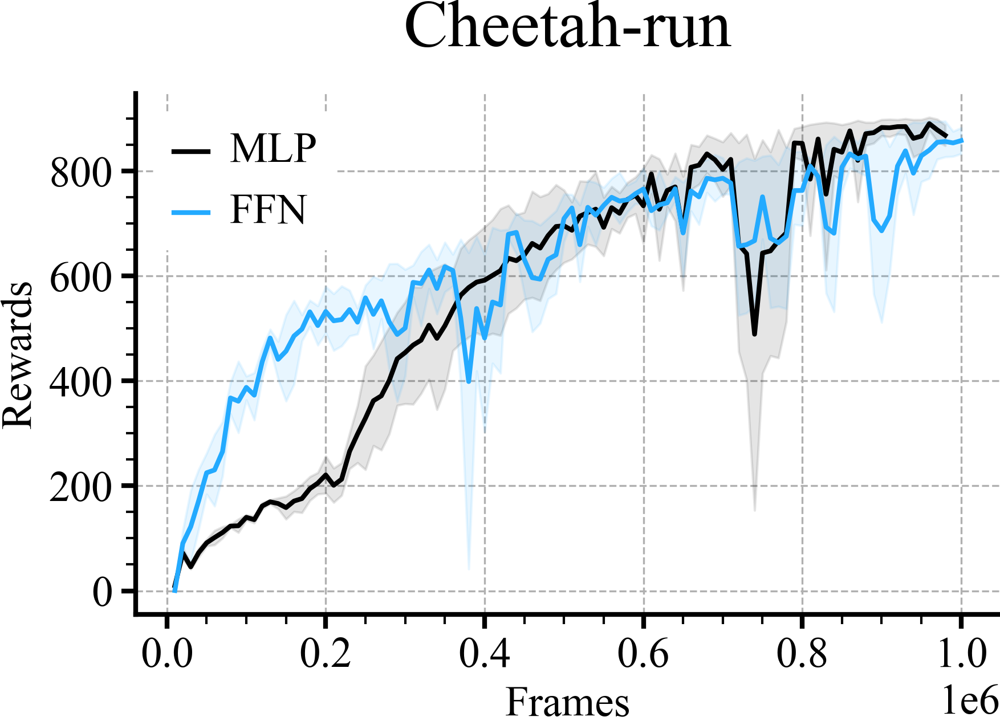
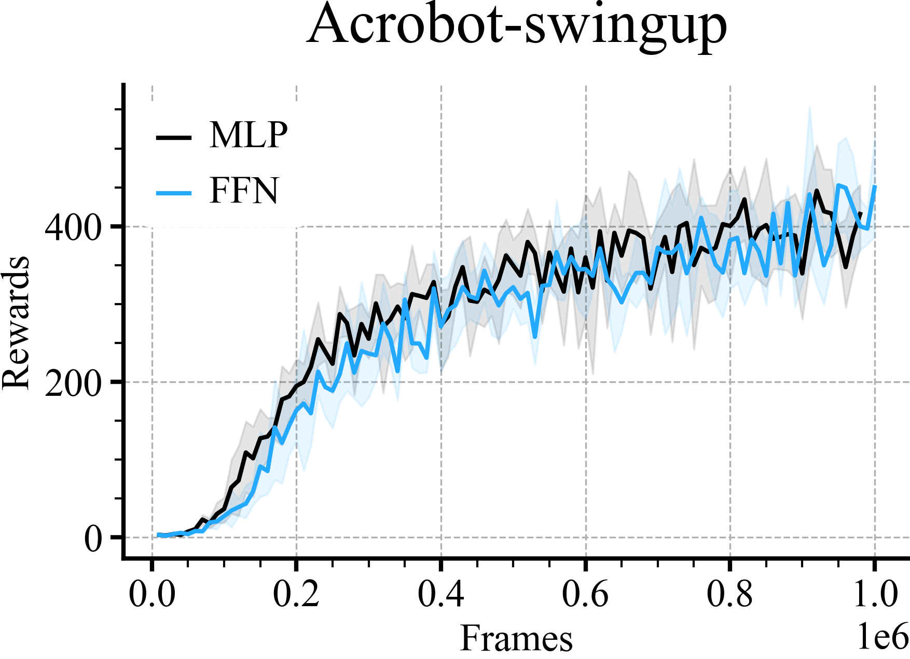
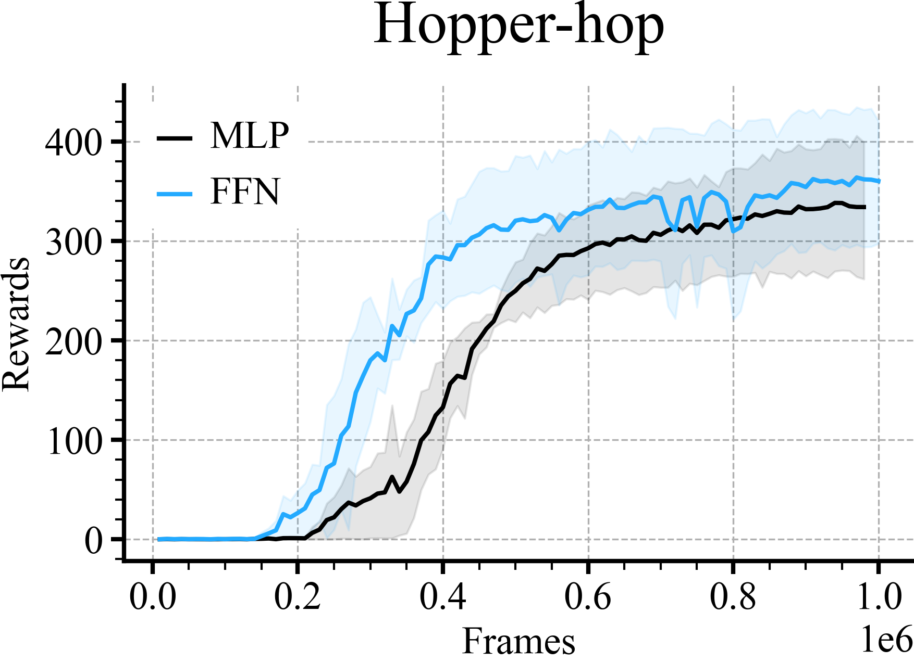
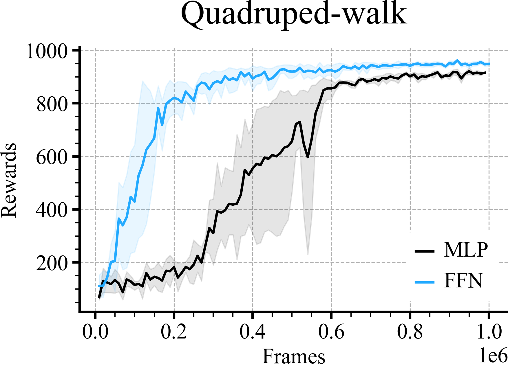
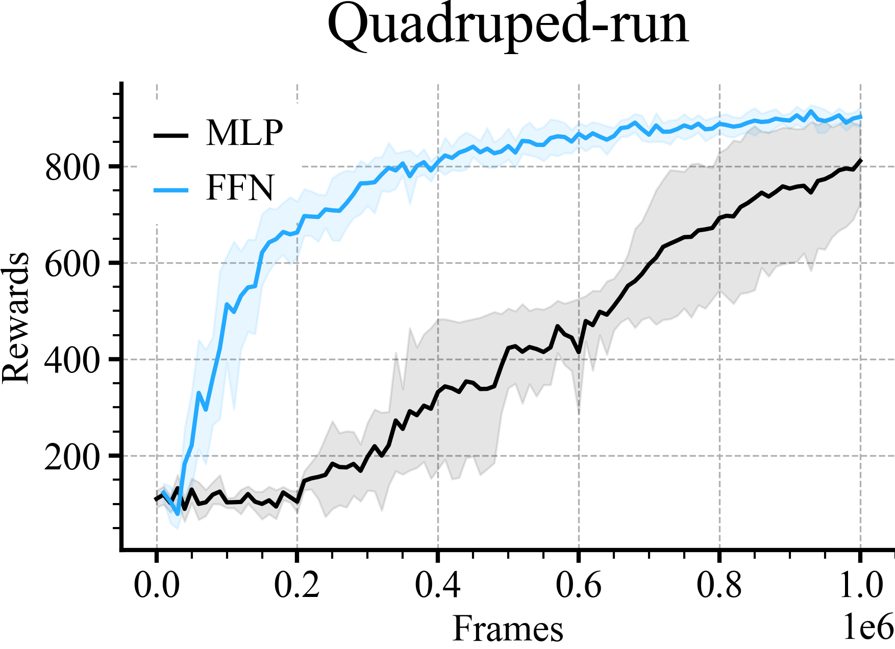
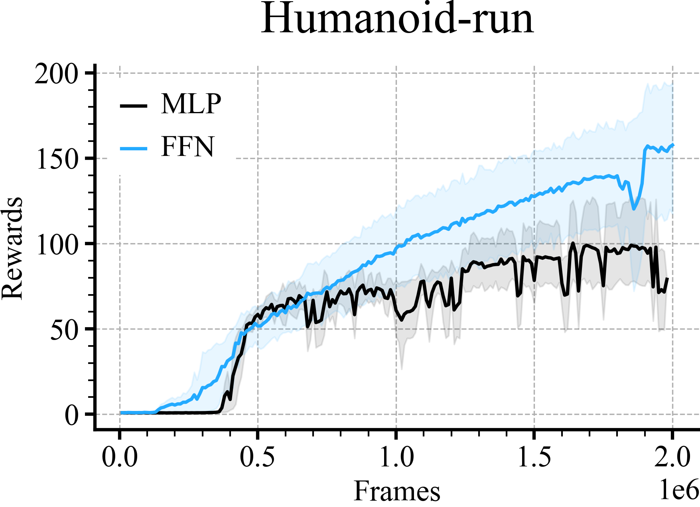
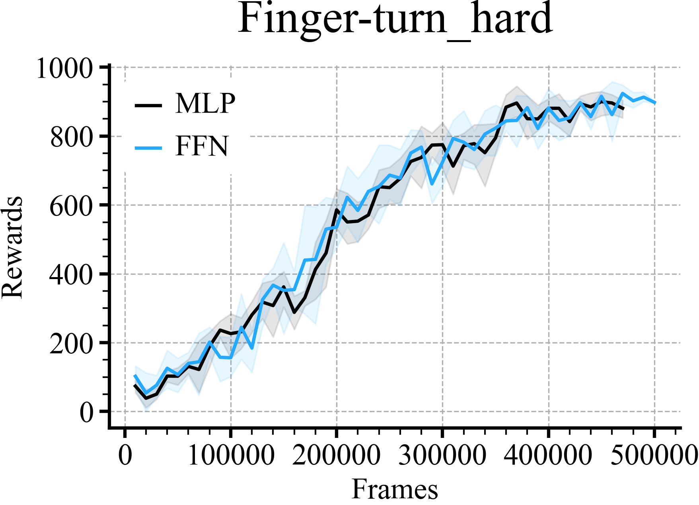
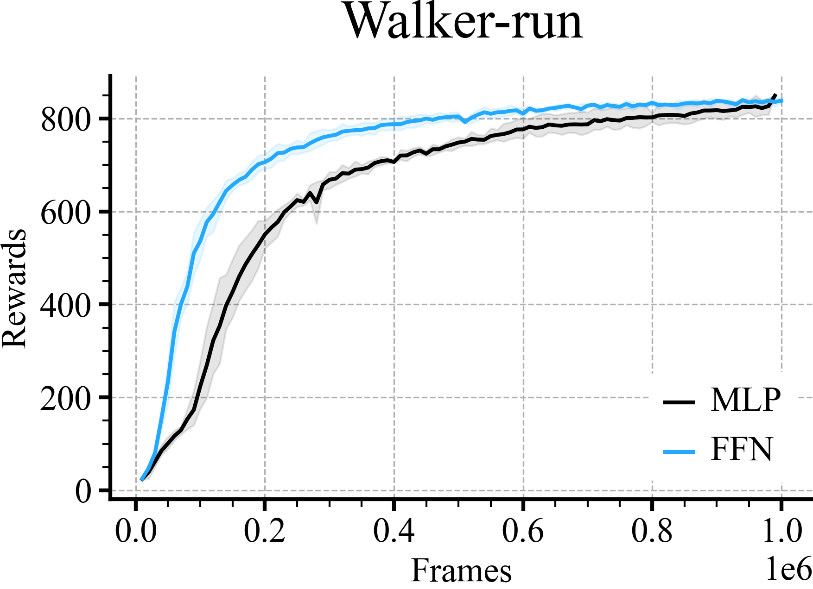
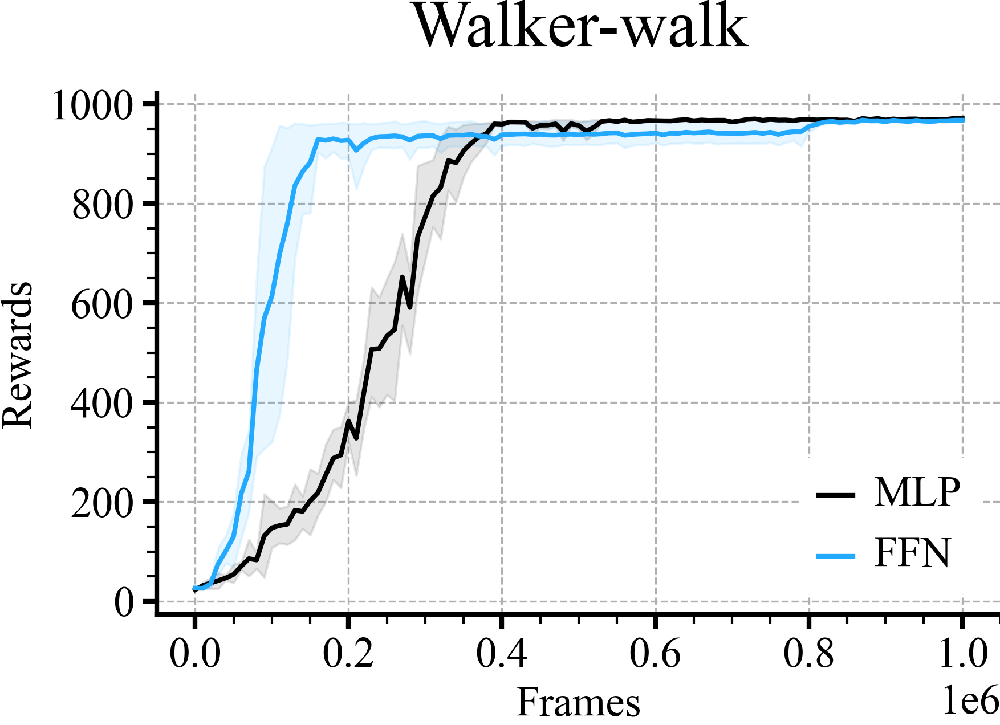
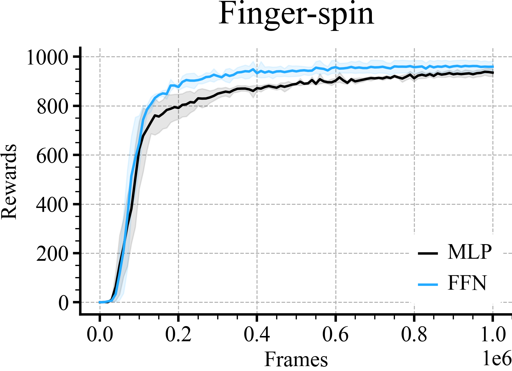

# MUJOCO Comparisons
```python
loader = ML_Logger(prefix="/model-free/model-free/")
```
```python
def plot_line(path, color, label, x_key, y_key, linestyle='-'):
    mean, low, high, step, = loader.read_metrics(f"{y_key}@mean",
                                                 f"{y_key}@16%",
                                                 f"{y_key}@84%",
                                                 x_key=f"{x_key}@min", path=path, dropna=True)
    plt.xlabel('Frames', fontsize=18)
    plt.ylabel('Rewards', fontsize=18)

    plt.plot(step.to_list(), mean.to_list(), color=color, label=label, linestyle=linestyle)
    plt.fill_between(step, low, high, alpha=0.1, color=color)
```
```python
for (e, (env, scale, nt_scale)) in enumerate(tqdm(zip(envs, scales, no_tgt_scales), desc="env-scales")):

    if e % 4 == 0:
        r = doc.table().figure_row()

    if env == 'Walker-walk':
        plot_line(path=f"sac_rff/baselines/sac/value_estimation/mlp/{env}/**/metrics.pkl", color='black', label='MLP',
                  x_key='timestep',
                  y_key="eval/return")
        plot_line(path=f"sac_rff/baselines/sac/value_estimation/lff/{env}/**/metrics.pkl", color=colors[0],
                  label='FFN',
                  x_key='timestep',
                  y_key="eval/return")
    elif env == 'Finger-spin':
        plot_line(path=f"sac_rff/over_estimation/value_estimation/mlp/{env}/**/metrics.pkl", color='black', label='MLP',
                  x_key='timestep',
                  y_key="eval/return")
        plot_line(path=f"sac_rff/over_estimation/value_estimation/lff/{env}/**/metrics.pkl", color=colors[0],
                  label='FFN',
                  x_key='timestep',
                  y_key="eval/return")
    else:
        plot_line(path=f"sac_dennis_rff/dmc/3_layer/mlp/{env}/**/metrics.pkl", color='black', label='MLP', x_key='frames',
                  y_key="eval/episode_reward/mean")


        plot_line(path=f"sac_dennis_rff/dmc/2_layer/lff/{env}/alpha_tune/scale-{scale}/**/metrics.pkl", color=colors[0], label=f'FFN',
                x_key='frames', y_key="eval/episode_reward/mean")

    plt.title(env)
    plt.legend()
    plt.tight_layout()
    [line.set_zorder(100) for line in plt.gca().lines]
    [spine.set_zorder(100) for spine in plt.gca().collections]
    r.savefig(f'{os.path.basename(__file__)[:-3]}/{env}.png', dpi=300, zoom=0.3, title=env)
    plt.savefig(f'{os.path.basename(__file__)[:-3]}/{env}.pdf', dpi=300, zoom=0.3)
    plt.close()
```

| **Cheetah-run** | **Acrobot-swingup** | **Hopper-hop** | **Quadruped-walk** |
|:---------------:|:-------------------:|:--------------:|:------------------:|
|  |  |  |  |

| **Quadruped-run** | **Humanoid-run** | **Finger-turn_hard** | **Walker-run** |
|:-----------------:|:----------------:|:--------------------:|:--------------:|
|  |  |  |  |

| **Walker-walk** | **Finger-spin** |
|:---------------:|:---------------:|
|  |  |
