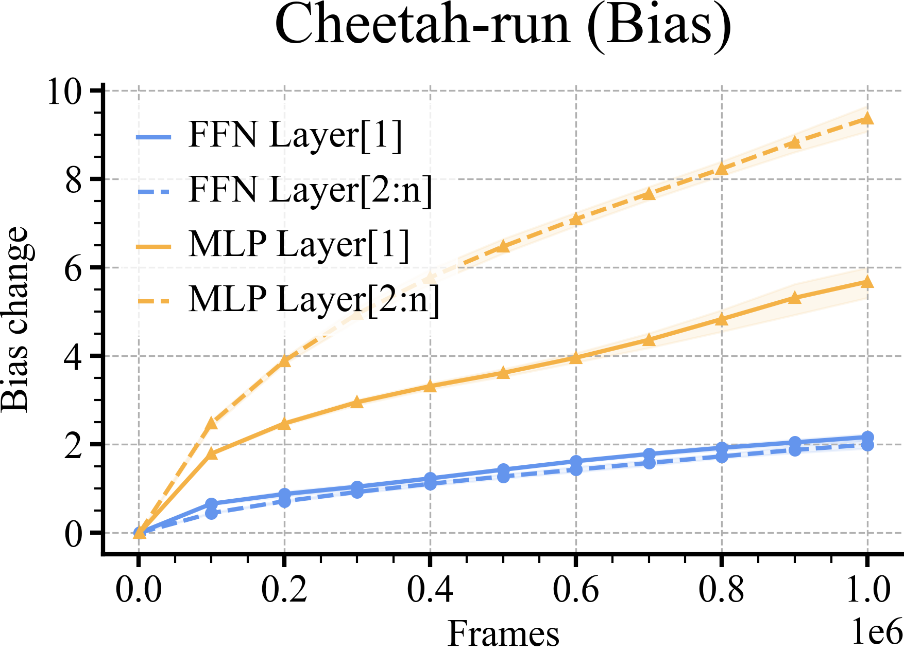
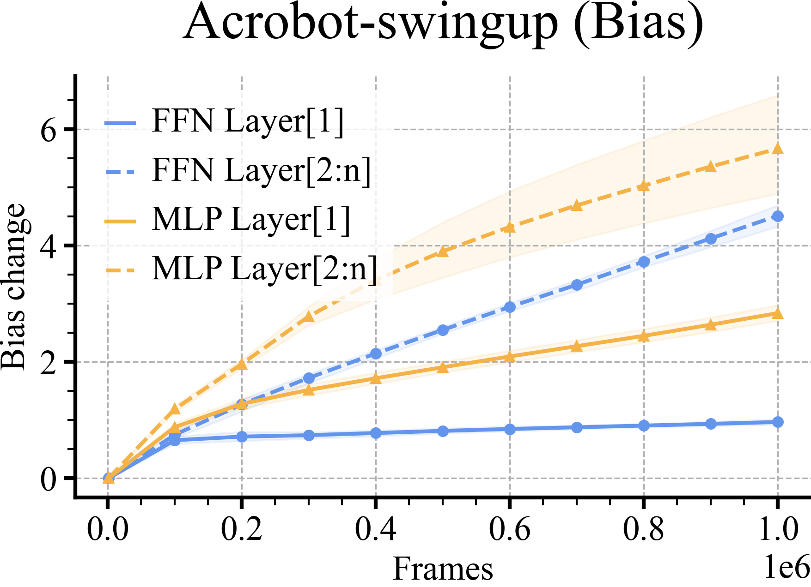
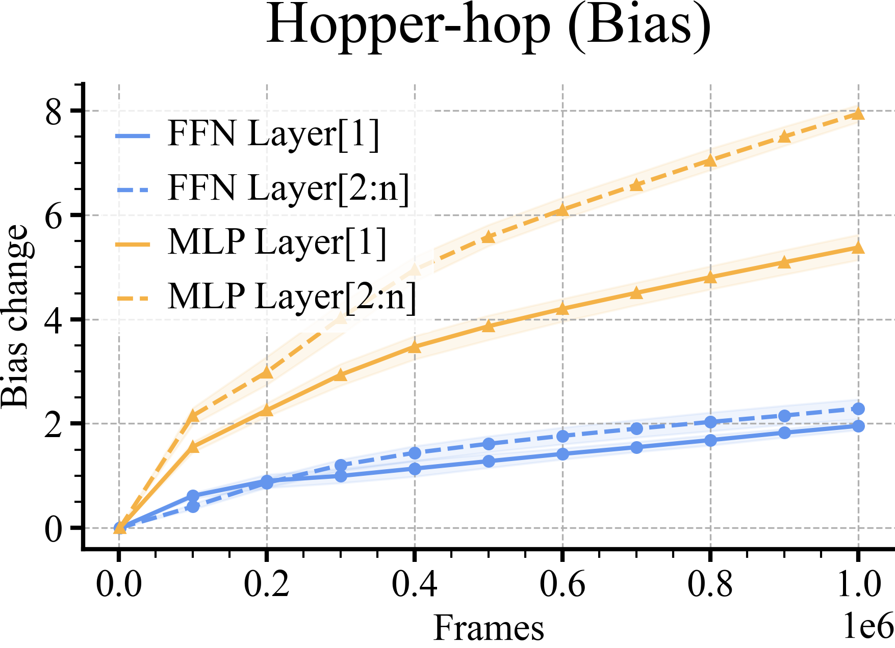
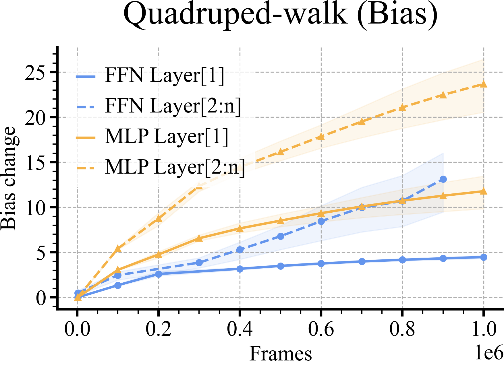
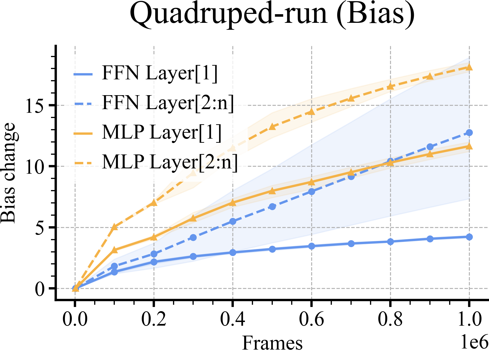
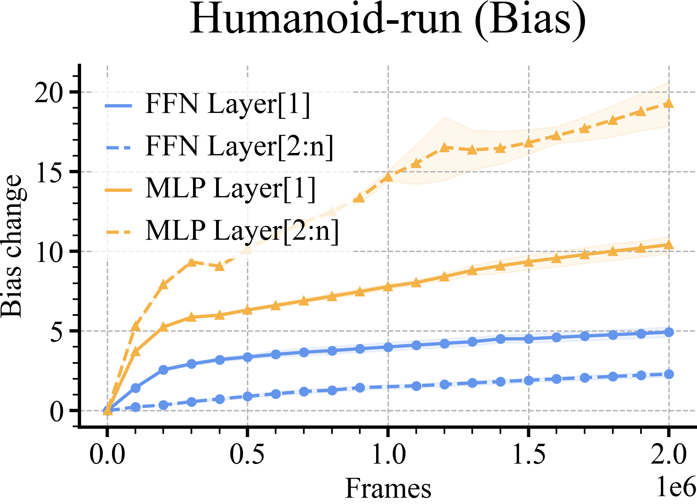
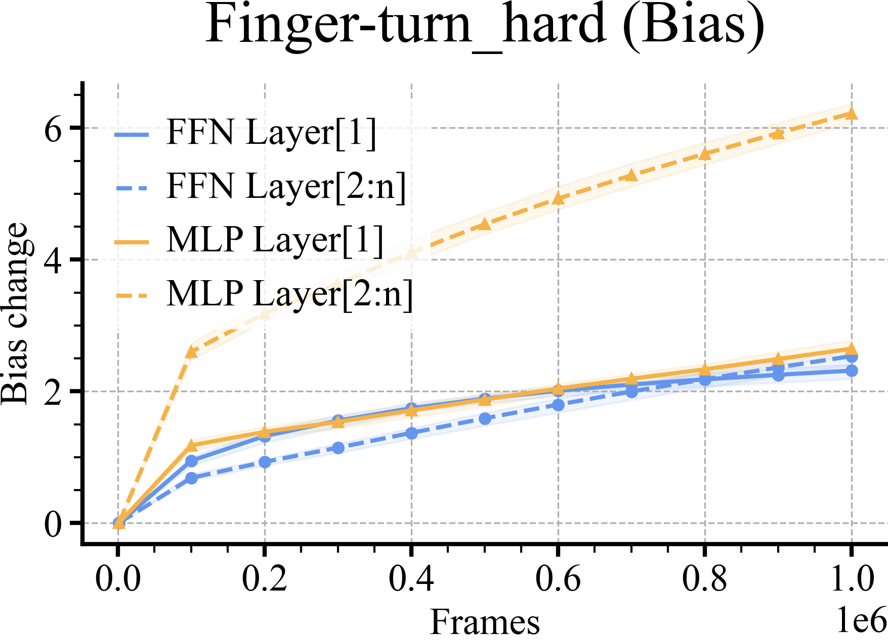
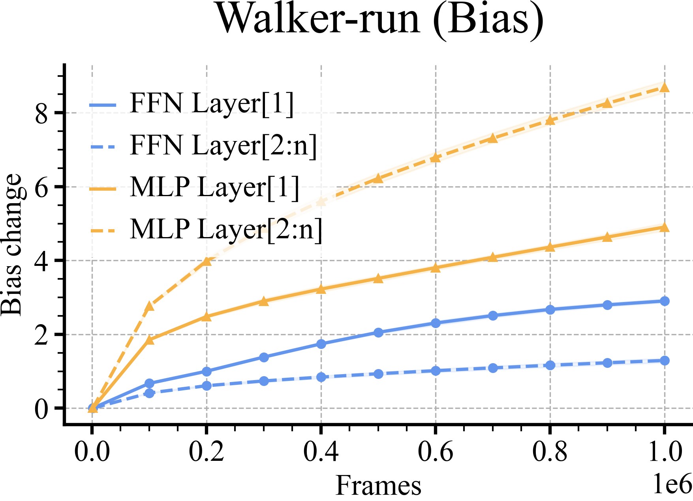

```python
for (i, (env_name, scale)) in enumerate(zip(env_names, scales)):

    if i % 4 == 0:
        r = doc.table().figure_row()

    lff_path = f'lff/{env_name}/alpha_tune/scale-{scale}/**/weight_diff_first/bias_diff.pkl'
    plot_line(lff_path, color='cornflowerblue', label="FFN Layer[1]")
    lff_path = f'lff/{env_name}/alpha_tune/scale-{scale}/**/weight_diff_after_first/bias_diff.pkl'
    plot_line(lff_path, color='cornflowerblue', style='--', label="FFN Layer[2:n]")

    mlp_path = f'mlp/{env_name}/**/weight_diff_first/bias_diff.pkl'
    plot_line(mlp_path, color=colors[-1], label='MLP Layer[1]', marker="^")
    mlp_path = f'mlp/{env_name}/**/weight_diff_after_first/bias_diff.pkl'
    plot_line(mlp_path, color=colors[-1], label='MLP Layer[2:n]', style='--', marker="^")

    plt.title(env_name + " (Bias)")
    plt.legend()
    plt.tight_layout()
    # [line.set_zorder(100) for line in plt.gca().lines]
    # [spine.set_zorder(100) for spine in plt.gca().collections]
    r.savefig(f'weight_diff_bias/{env_name}.png', dpi=300, zoom=0.3, title=env_name)
    plt.savefig(f'weight_diff_bias/{env_name}.pdf', dpi=300, zoom=0.3)
    plt.close()
```

| **Cheetah-run** | **Acrobot-swingup** | **Hopper-hop** | **Quadruped-walk** |
|:---------------:|:-------------------:|:--------------:|:------------------:|
|  |  |  |  |

| **Quadruped-run** | **Humanoid-run** | **Finger-turn_hard** | **Walker-run** |
|:-----------------:|:----------------:|:--------------------:|:--------------:|
|  |  |  |  |
