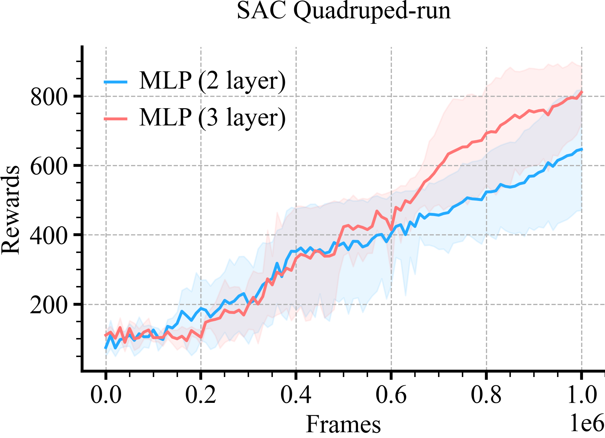

# MUJOCO Comparisons
```python
loader = ML_Logger(prefix="model-free/model-free/sac_dennis_rff/dmc")
```
```python
def plot_line(path, color, label, x_key, y_key, bin_size=1):
    mean, low, high, step, = loader.read_metrics(f"{y_key}@mean",
                                                 f"{y_key}@16%",
                                                 f"{y_key}@84%",
                                                 x_key=f"{x_key}@min", path=path, bin_size=bin_size, dropna=True)
    plt.xlabel('Frames', fontsize=18)
    plt.ylabel('Rewards', fontsize=18)

    plt.plot(step.to_list(), mean.to_list(), color=color, label=label)
    plt.fill_between(step, low, high, alpha=0.1, color=color)
```
SAC-RFF vs SAC
```python
env_name = 'Quadruped-run-v1'
plt.title(f"SAC {env_name[:-3]}", fontsize=18)
plot_line(path=f"2_layer/mlp/{env_name[:-3]}/**/metrics.pkl", x_key="frames", y_key="eval/episode_reward/mean",
          label='MLP (2 layer)', color=colors[0])
plot_line(path=f"3_layer/mlp/{env_name[:-3]}/**/metrics.pkl", x_key="frames", y_key="eval/episode_reward/mean",
          label='MLP (3 layer)', color=colors[1],)
plt.legend()
plt.tight_layout()
doc.savefig(f'{os.path.basename(__file__)[:-3]}/{env_name}.png', dpi=300, zoom=0.3)
plt.close()
```


