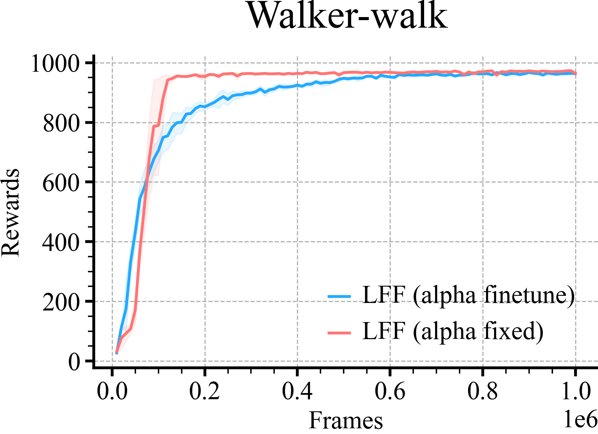

# MUJOCO Comparisons
```python
loader = ML_Logger(prefix="model-free/model-free/sac_dennis_rff/dmc/2_layer/lff/")
```
```python
def plot_line(path, color, label, x_key, y_key):
    mean, low, high, step, = loader.read_metrics(f"{y_key}@mean",
                                                 f"{y_key}@16%",
                                                 f"{y_key}@84%",
                                                 x_key=f"{x_key}@min", path=path, dropna=True)
    plt.xlabel('Frames', fontsize=18)
    plt.ylabel('Rewards', fontsize=18)

    plt.plot(step.to_list(), mean.to_list(), color=color, label=label)
    plt.fill_between(step, low, high, alpha=0.1, color=color)
```
```python
r = doc.table().figure_row()
for env in tqdm(envs, desc="env"):

    plot_line(path=f"alpha_tune/scale-0.001/{env}/**/metrics.pkl", color=colors[0], label='LFF (alpha finetune)', x_key='frames', y_key="eval/episode_reward/mean")
    plot_line(path=f"alpha_fixed-0.1/scale-0.001/{env}/**/metrics.pkl", color=colors[1], label='LFF (alpha fixed)', x_key='frames', y_key="eval/episode_reward/mean")
    plt.title(env)
    plt.legend()
    plt.tight_layout()
    r.savefig(f'{os.path.basename(__file__)[:-3]}/{env}.png', dpi=300, zoom=0.3, title=env)
    plt.savefig(f'{os.path.basename(__file__)[:-3]}/{env}.pdf', dpi=300, zoom=0.3)
    plt.close()
```

| **Walker-walk** |
|:---------------:|
|  |
