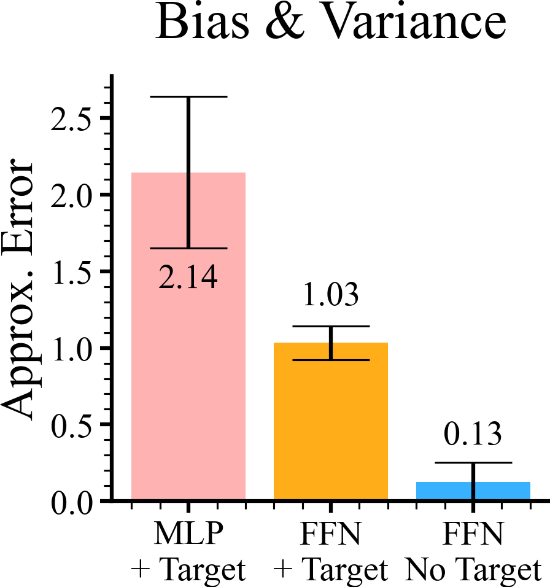

## Learning without a target network

We need to first evaluate the bias using a target network. 

```python
rmse, std = np.stack([
    error_mean_var(mlp_q_values, gt_q_values),
    error_mean_var(rff_q_values, gt_q_values),
    error_mean_var(rff_no_tgt_q_values, gt_q_values)
]).T

labels = ["MLP\n+ Target", "FFN\n+ Target", "FFN\nNo Target"]
colors = np.array([(1, 0, 0, 0.3), (1, 165 / 255, 0, 0.9),
                   (34 / 255, 169 / 255, 1, 0.9)])
label_pos = rmse + [-0.8, 0.2, 0.2]
# alphas = [0.3, 0.9, 0.8]

plt.figure(figsize=(4.5, 4.8))
plt.bar(range(3), rmse, yerr=std, color=colors, tick_label=labels, capsize=20)
for pos, err, v_pos in zip(range(3), rmse, label_pos):
    # plt.bar(pos, err, yerr=var, color=c, alpha=a, tick_label=l, capsize=20)
    plt.text(pos, v_pos, f"{err:.2f}", ha="center", va="bottom")

plt.title("Bias & Variance")
plt.ylabel("RMSE")
plt.ylabel("Approx. Error")
plt.tight_layout()
row.savefig(f"{Path(__file__).stem}/bias_comparison.png")
plt.savefig(f"{Path(__file__).stem}/bias_comparison.pdf")
```

|  |
|:--------------------------------------------------------------------------------------------------------------------------------------------------------:|
