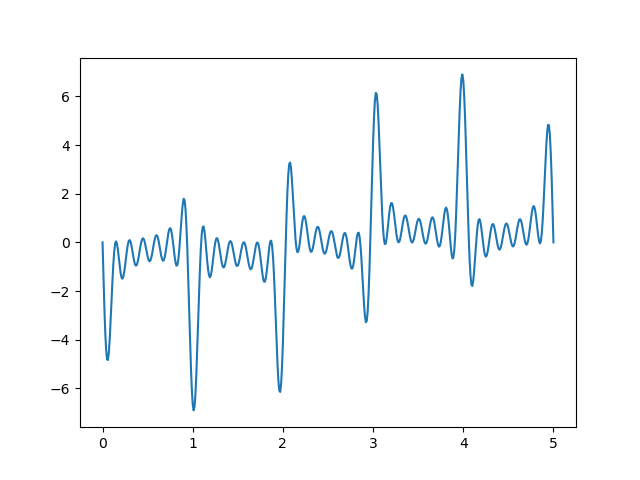
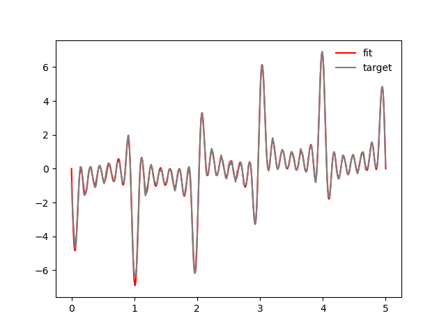
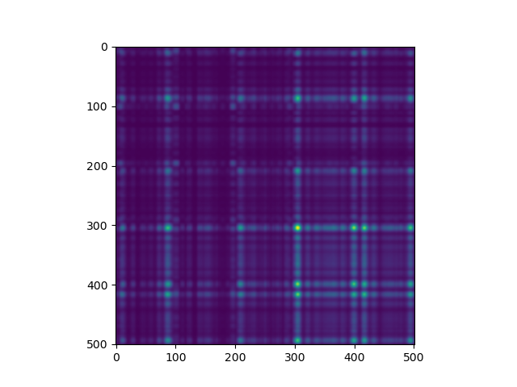

# S-Rank of A Neural Network

Step 1: make a function
Step 4: Compute the spectral entropy of the target function (4.14)
Step 2: learn a neural network
Step 3: Compute the rank of the network

```python
N = 501
b = 7
xs = np.linspace(0, 5, N)
bs = np.linspace(-1, 1, N)
spectrum = 2 * np.pi * np.arange(b)
target_fn = np.sum([np.sin(k * xs + np.pi * bs) for k in spectrum], axis=0)
plt.plot(xs, target_fn)
r.savefig(f"{Path(__file__).stem}/target_fn.png", zoom="50%")
```

|  |
|:-------------------------------------------------------------------------------------------------------------------------------------------------:|

We can now calculate the spectral entropy of this target function. This 
should be a uniform distribution between $[0, 2 \pi * 10]$. This means the
Shannon Entropy is $\log (2 \pi * 7)$ = 3.78.

```python
from scipy import stats

# spectral_range = [0, 2 * np.pi * 10]
h_spectral = stats.differential_entropy(spectrum)
doc.print(f"spectral entropy from discrete spectrum: {h_spectral:0.4f}")

spectrum = np.random.uniform(0, 2 * np.pi * b, size=101)
h_spectral = stats.differential_entropy(spectrum)
doc.print(f"spectral entropy from uniform: {h_spectral:0.4f}")
```

```
spectral entropy from discrete spectrum: 4.0293
spectral entropy from uniform: 3.7627
```
```python
import torch
from torch import nn
from torch import optim
from simple_ntk.models import RFF
from tqdm import trange

network = nn.Sequential(
    RFF(1, 40, scale=10),
    nn.Linear(40, 20), nn.ReLU(),
    nn.Linear(20, 20), nn.ReLU(),
    nn.Linear(20, 20), nn.ReLU(),
    nn.Linear(20, 1),
)

xs_t = torch.Tensor(xs)[..., None]
target_t = torch.Tensor(target_fn)[..., None]
optim = optim.Adam(network.parameters(), lr=1e-3)
for i in trange(200):
    output = network(xs_t)
    loss = nn.functional.smooth_l1_loss(output, target_t)

    optim.zero_grad()
    loss.backward()
    optim.step()

    print("\rloss:", loss.detach().cpu().item())

plt.plot(xs, target_fn, color='red', label="fit")
plt.plot(xs, output.detach().cpu().numpy(), color='gray', label="target")
plt.legend(frameon=False)
r.savefig(f"{Path(__file__).stem}/fit.png", zoom="50%", caption="Fit Result")
plt.close()
```

|  |
|:-------------------------------------------------------------------------------------------------------------------------------------------:|
| Fit Result |
```python
network_2 = nn.Sequential(
    RFF(1, 40, scale=10),
    nn.Linear(40, 20), nn.ReLU(),
    nn.Linear(20, 20), nn.ReLU(),
    nn.Linear(20, 20), nn.ReLU(),
)
network_2.load_state_dict(network.state_dict(), strict=False)

with torch.no_grad():
    zs = network_2(xs_t).cpu()

gram_matrix = zs @ zs.T
print(gram_matrix.shape)

plt.imshow(gram_matrix.numpy())
r.savefig(f"{Path(__file__).stem}/gram_matrix.png", zoom="50%", caption="Feature Gram Matrix")
```

|  |
|:---------------------------------------------------------------------------------------------------------------------------------------------------:|
| Feature Gram Matrix |


## Now we can calculate the SVG

```python
sgv = torch.linalg.svdvals(gram_matrix).numpy()
```
normalize the singular values via the spectram norm
```python
sgv /= sgv.sum()
doc.print(sgv.shape)
```

```
(501,)
```
```python
def H_d(ps):
    ps_norm = ps / ps.sum()
    return - np.sum(np.log(ps) * ps_norm)
```


Now the Shannon entropy of the matrix is 0.3866322338581085
