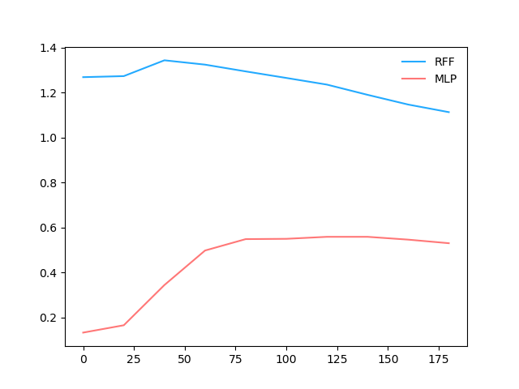

# S-Rank of A Neural Network During Evolution


```python
import torch
from torch import nn
from torch import optim
from tqdm import trange
from ml_logger import logger
from simple_ntk.models import RFF
```
```python
N = 1001
b = 20
xs = np.linspace(0, 5, N)
bs = np.linspace(-1, 1, N)
spectrum = 2 * np.pi * np.arange(b)
target_fn = np.sum([np.sin(k * xs + np.pi * bs) for k in spectrum], axis=0)
plt.plot(xs, target_fn)
r.savefig(f"{Path(__file__).stem}/target_fn.png", zoom="50%")
```

|  |
|:-----------------------------------------------------------------------------------------------------------------------------------------------------------:|
```python
def feat(network, xs):
    *layers, last = network
    for l in layers:
        xs = l(xs)
    return xs


def H_d(ps):
    ps_norm = ps / ps.sum()
    return - np.sum(np.log(ps) * ps_norm)


@torch.no_grad()
def H_srank(xs, feat_fn, net):
    zs = feat_fn(net, xs)
    gram_matrix = zs @ zs.T
    sgv = torch.linalg.svdvals(gram_matrix)
    sgv /= sgv.sum()
    return H_d(sgv.cpu().numpy())
```

## How does Architecture Affect The Rank?


```python
network = nn.Sequential(
    RFF(1, 40, scale=10),
    nn.Linear(40, 20), nn.ReLU(),
    nn.Linear(20, 20), nn.ReLU(),
    nn.Linear(20, 1),
)
fitted = train(network, prefix="RFF")
colors = ['#23aaff', '#ff7777']
visualize(fitted, prefix="RFF")

network = nn.Sequential(
    nn.Linear(1, 40), nn.ReLU(),
    nn.Linear(40, 20), nn.ReLU(),
    nn.Linear(20, 20), nn.ReLU(),
    nn.Linear(20, 1),
)
fitted = train(network, prefix="MLP")
visualize(fitted, prefix="MLP")
```
|  |  |
|:-----------------------------------------------------------------------------------------------------------------------------------------------------:|:--------------------------------------------------------------------------------------------------------------------------------------------------------:|
| Fit Result | S-Rank |


## How does B_scale Affect the Rank?

```python
colors = ['#23aaff', '#9799f9', '#d784db', '#ff7777', "orange"]
for scale in [2, 5, 10, 20, 30]:
    network = nn.Sequential(
        RFF(1, 40, scale=10),
        nn.Linear(40, 20), nn.ReLU(),
        nn.Linear(20, 20), nn.ReLU(),
        nn.Linear(20, 1),
    )
    fitted = train(network, prefix=f"RFF {scale}")
    visualize(fitted, prefix=f"RFF {scale}")
```
|  |  |
|:-----------------------------------------------------------------------------------------------------------------------------------------------------------:|:--------------------------------------------------------------------------------------------------------------------------------------------------------------:|
| Fit Result | S-Rank |
