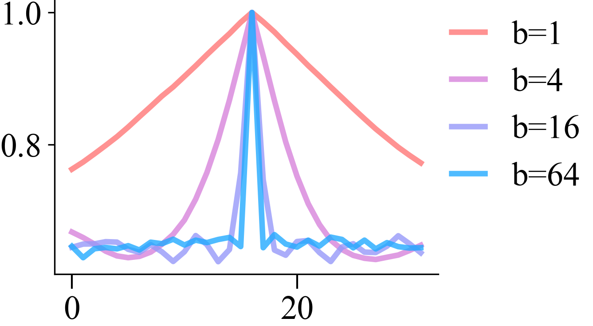
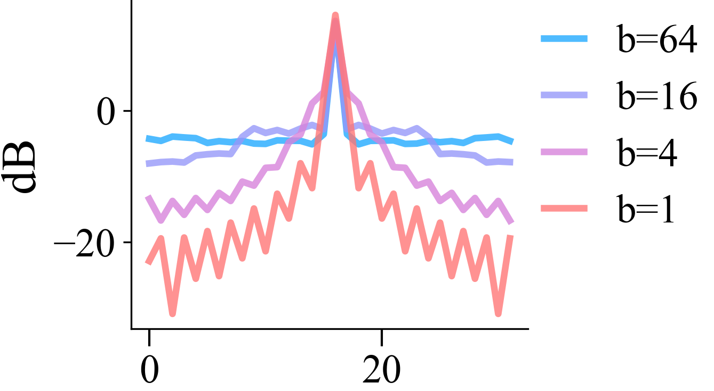

# Band Tunnability with Random Fourier Features

An important feature is the ability to fine-tune the frequency band to match that of the target function.

```python
np.random.seed(100)
torch.random.manual_seed(100)


class RFF(nn.Linear):
    def __init__(self, in_features, mapping_size, band_limit: int):
        super().__init__(in_features, mapping_size)
        nn.init.uniform_(self.weight, - band_limit / np.sqrt(in_features), band_limit / np.sqrt(in_features))
        nn.init.uniform_(self.bias, -1, 1)
        self.requires_grad_(False)

    def forward(self, x):
        z = super().forward(x)
        return torch.sin(np.pi * z)
```
```python
def get_ntk(net, xs):
    grad = []
    out = net(torch.FloatTensor(xs)[:, None])
    for o in tqdm(out, desc="NTK", leave=False):
        net.zero_grad()
        o.backward(retain_graph=True)
        grad_vec = torch.cat([p.grad.view(-1) for p in net.parameters() if p.grad is not None]).numpy()
        grad.append(grad_vec / np.linalg.norm(grad_vec))
        net.zero_grad()

    grad = np.stack(grad)
    gram_matrix = grad @ grad.T
    return gram_matrix
```
| **Cross Section** | **Spectrum** |
|:-----------------:|:------------:|
|  |  |
