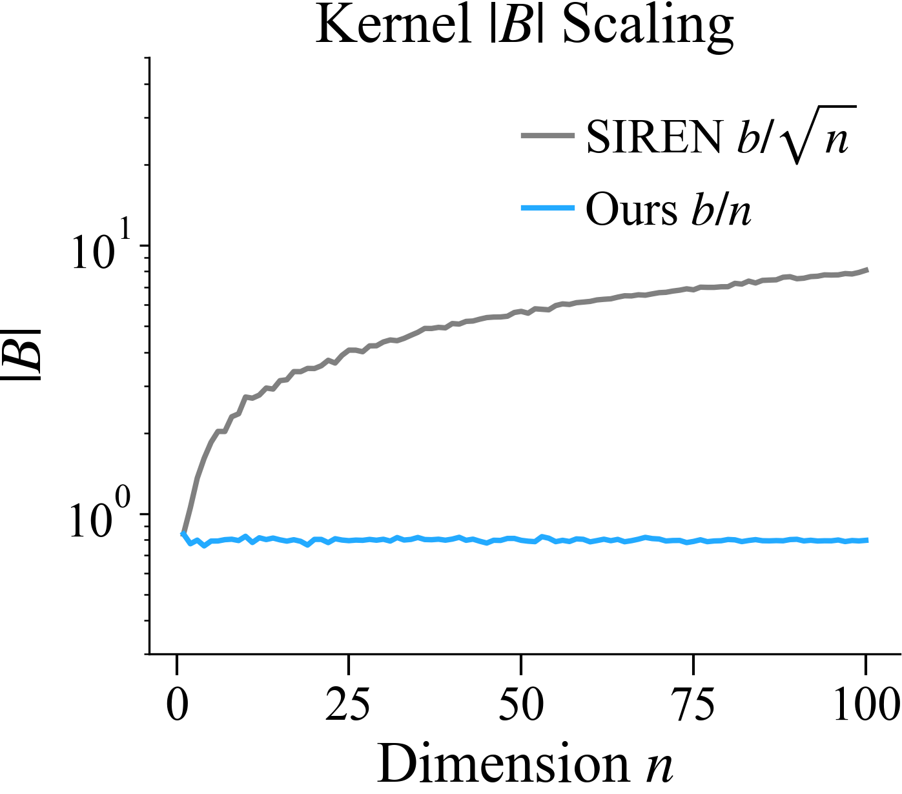
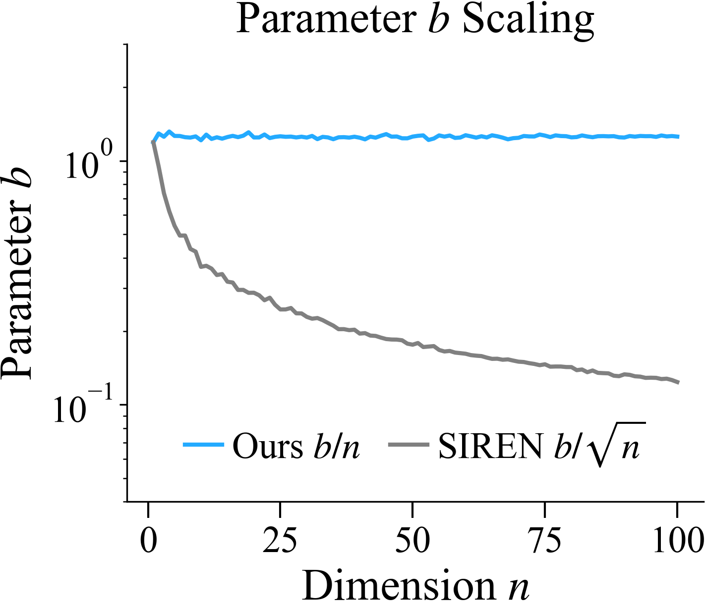

# How does the row sum scale with Gaussian?

```python
np.random.seed(100)
torch.random.manual_seed(100)

dims = np.arange(1, 101)
samples = 100
```

The scale of the matrix
$$
\vert W \vert
$$
determines the width of the NTK. We can compute the bandwidth
parameters needed to compensate for the growth in dimension via
the following:

```python
def get_row_scale(pdf, n_dim, samples):
    return pdf(n_dim, [samples, n_dim]).abs().mean(dim=0).sum().item()


siren_pdf = lambda dim, *_: torch.normal(0, 1 / np.sqrt(dim), *_)
our_pdf = lambda dim, *_: torch.normal(0, 1 / dim, *_)

for d in dims:
    s = get_row_scale(siren_pdf, d, samples)
    o = get_row_scale(our_pdf, d, samples)
    logger.store_metrics(
        siren_B_abs=s,
        our_B_abs=o,
        siren_scaling=1 / s,
        our_scaling=1 / o
    )
```
|  |  |
|:---------------------------------------------------------------------------------------------------------------------------------------------------:|:---------------------------------------------------------------------------------------------------------------------------------------------------:|
