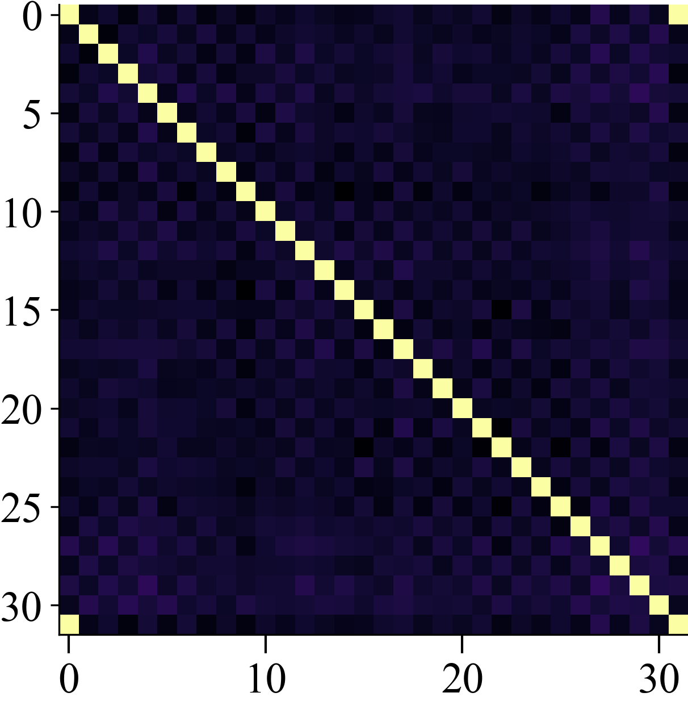
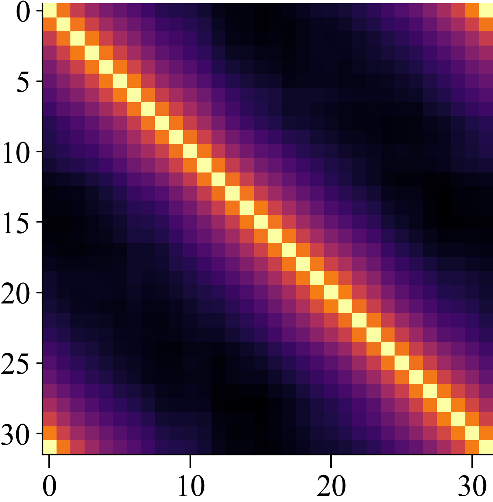
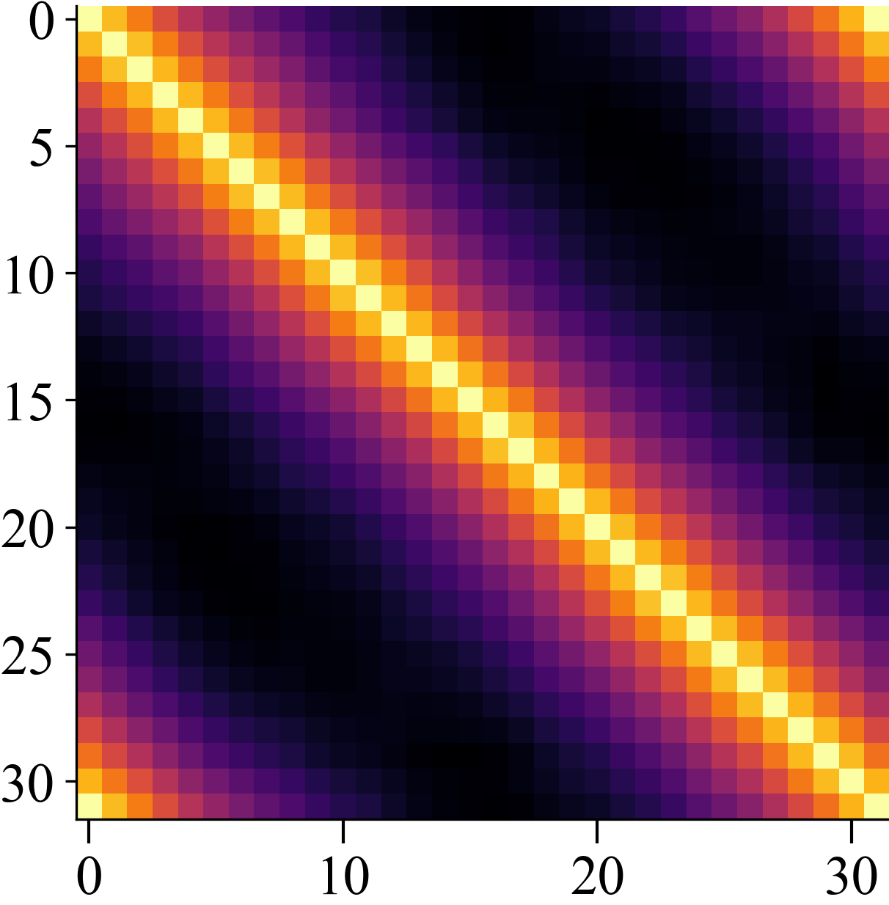
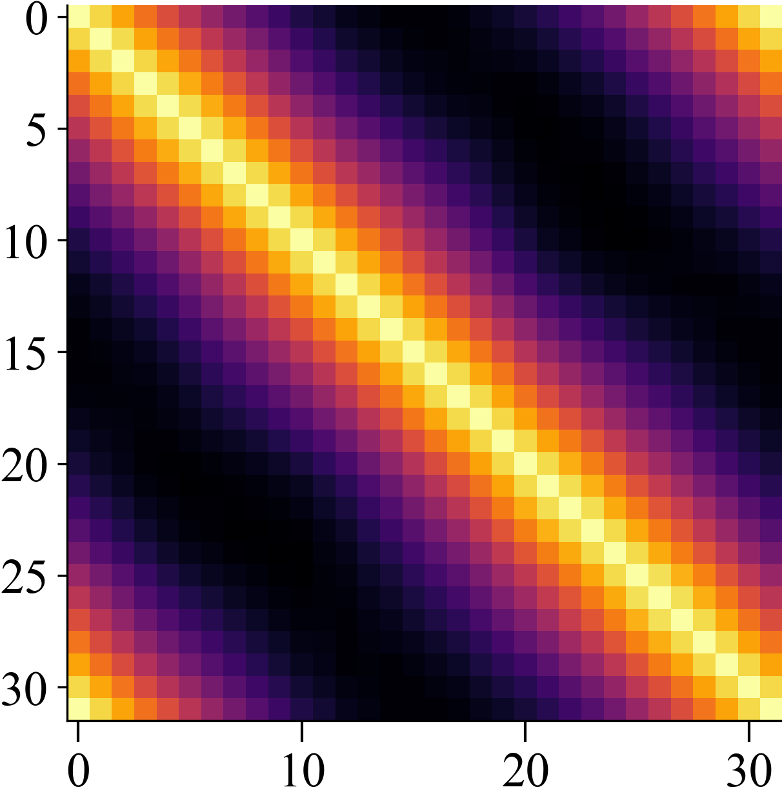

# Gram Matricies of Different Network Architectures

We visualize the gram matrix of the following architectures
1. A piece-wise linear network: MLP with ReLU Activation
2. An MLP with tahn activation
3. A dense Network~\citep{}
4. A 
First of all, let's take a look at the implementation:

```python
class FF(nn.Module):
    def __init__(self, band_limit: int, p: float):
        self.b_s = torch.arange(1, band_limit + 1)
        self.a_s = 1 / torch.pow(self.b_s, p)
        super().__init__()

    def forward(self, x):
        return torch.cat([
            self.a_s * torch.sin(2. * np.pi * x * self.b_s),
            self.a_s * torch.cos(2. * np.pi * x * self.b_s)
        ], dim=-1) / torch.norm(self.a_s)
```

Now there are a few crucial points. First of all, there are
these two parameters `a` and `b`. In fourier features, the
parameter `b` corresponds to the frequencies. Fourier features
use equally spaced octaves.

```python
def get_ntk(net, xs):
    grad = []
    out = net(torch.FloatTensor(xs)[:, None])
    for o in tqdm(out, desc="NTK", leave=False):
        net.zero_grad()
        o.backward(retain_graph=True)
        grad_vec = torch.cat([p.grad.view(-1) for p in net.parameters() if p.grad is not None]).numpy()
        grad.append(grad_vec / np.linalg.norm(grad_vec))
        net.zero_grad()

    grad = np.stack(grad)
    gram_matrix = grad @ grad.T
    return gram_matrix
```
| **Kernel** | **Kernel** | **Kernel** | **Kernel** | **Kernel** |
|:----------:|:----------:|:----------:|:----------:|:----------:|
|  |  |  |  |  |
