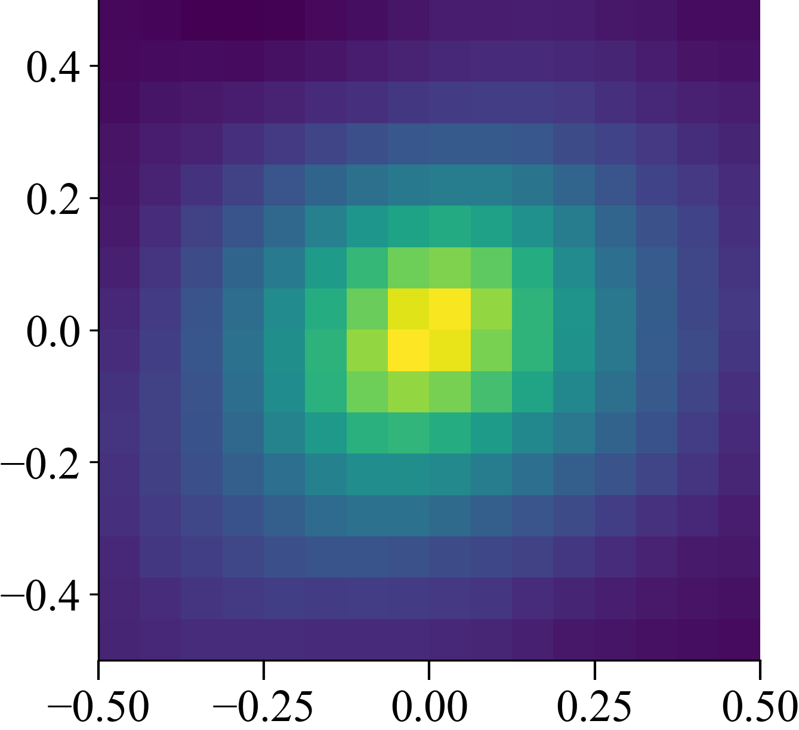
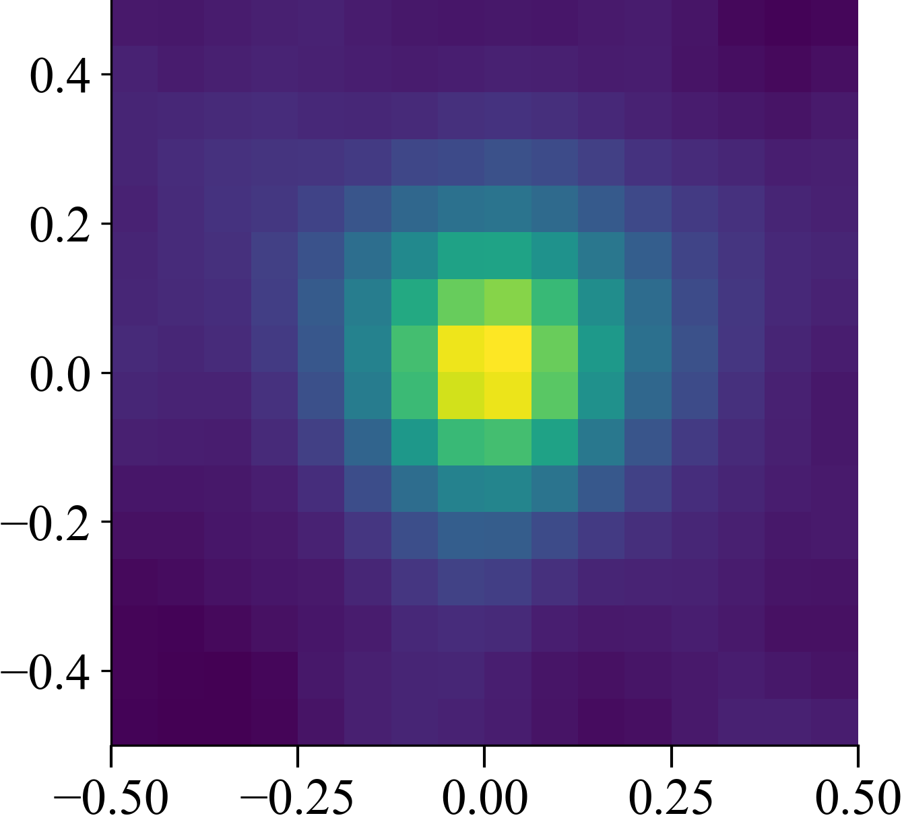

# Rotationally Invariant Kernel with Isotropic Frequency Sampling

```python
np.random.seed(100)
torch.random.manual_seed(100)
```

A main challenge with using random fourier features in RL is that the
state space can be quite high-dimensional. Here we want to evaluate
how important it is to mix the input dimensions with a single random matrix.
We compare the standard standard implementation below

```python
class RFF(nn.Linear):
    def __init__(self, in_features, mapping_size, band_limit: int, init="uniform"):
        super().__init__(in_features, mapping_size)
        if init == "uniform":
            nn.init.uniform_(self.weight, - band_limit / in_features,
                             band_limit / in_features)
        elif init == "orthogonal":
            nn.init.orthogonal_(self.weight, np.pi * band_limit / np.sqrt(in_features))
        elif init == "normal":
            nn.init.normal_(self.weight, 0, band_limit / in_features)
        nn.init.uniform_(self.bias, -1, 1)
        self.out_features = in_features * mapping_size
        self.requires_grad_(False)

    def forward(self, x):
        z = super().forward(x)
        return torch.sin(np.pi * z)
```

against a variant that transforms each entry individually

```python
class RFF_1d_conv(nn.Linear):
    def __init__(self, in_features, out_features, band_limit: int):
        super().__init__(1, out_features // in_features)
        nn.init.uniform_(self.weight, - band_limit, band_limit)
        nn.init.uniform_(self.bias, -1, 1)
        self.out_features = out_features

    def forward(self, x):
        B, C = x.shape
        z = super().forward(x.reshape(B * C, -1))
        return torch.sin(np.pi * z).view(B, self.out_features)
```
```python
def get_ntk(net, xs, center):
    xs = np.concatenate([center[None, :], xs])

    grad = []
    out = net(torch.FloatTensor(xs))
    for o in tqdm(out, desc="NTK", leave=False):
        net.zero_grad()
        o.backward(retain_graph=True)
        grad_vec = torch.cat([p.grad.view(-1) for p in net.parameters() if p.grad is not None]).numpy()
        # grad.append(grad_vec / np.linalg.norm(grad_vec))
        grad.append(grad_vec)

    grad = np.stack(grad)
    gram_matrix = grad[:1] @ grad[1:].T
    return gram_matrix
```
```python
xs = np.linspace(-0.5, 0.5, n)
xs = np.stack(np.meshgrid(xs, xs)).reshape(2, -1).T
center = np.array([0, 0])

mixing_kernel = 0  # average from ten networks
for i in trange(5, desc="averaging networks", leave=False):
    net = nn.Sequential(RFF(2, 32, band_limit), MLP(32, 1024, 4, 1))
    mixing_kernel += 0.2 * get_ntk(net, xs, center)

conv_kernel = 0  # average from ten networks
for i in trange(5, desc="averaging networks", leave=False):
    net = nn.Sequential(RFF_1d_conv(2, 32, band_limit), MLP(32, 1024, 4, 1))
    conv_kernel += 0.2 * get_ntk(net, xs, center)

ortho_kernel = 0  # average from ten networks
for i in trange(5, desc="averaging networks", leave=False):
    net = nn.Sequential(RFF(2, 32, band_limit, init="orthogonal"), MLP(32, 1024, 4, 1))
    ortho_kernel += 0.2 * get_ntk(net, xs, center)

iso_norm_kernel = 0  # average from ten networks
for i in trange(5, desc="averaging networks", leave=False):
    net = nn.Sequential(RFF(2, 32, band_limit, init="normal"), MLP(32, 1024, 4, 1))
    iso_norm_kernel += 0.2 * get_ntk(net, xs, center)
```
| **Uniform W** | **Non-mixing W** | **Isotropic W** | **Iso-Normal W** |
|:-------------:|:----------------:|:---------------:|:----------------:|
|  |  |  |  |
