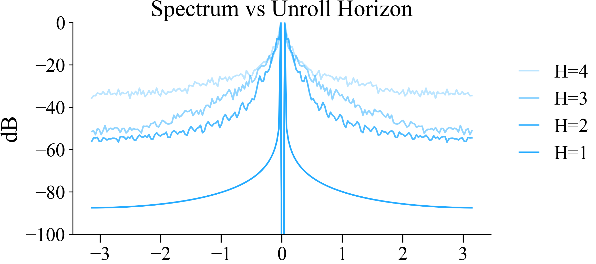

```python
def vi_by_horizon(rewards, dyn_mats, gamma=0.9, H=10):
    q_values = np.zeros(dyn_mats.shape[:2])

    for step in range(H):
        q_max = q_values.max(axis=0)
        q_values = rewards + gamma * (dyn_mats @ q_max)

    return q_values
```

Collect the spectrum from a collection of MDPs.

```python
for H, alpha in tqdm(zip([4, 3, 2, 1], [0.3, 0.5, 0.8, 1]), leave=False):
    centered_spectrum = 0
    for seed in trange(100):
        torch.manual_seed(seed)
        mdp = ToyMDP(seed=seed, k=10)

        states, rewards, dyn_mats = mdp.get_discrete_mdp(num_states=200)
        q_1, q_2 = vi_by_horizon(rewards, dyn_mats, gamma=1, H=H)

        spectrum = fft(q_1 / (q_1.mean() + 1e-12) - 1)
        centered_spectrum += fftshift(spectrum).__abs__()

    a = centered_spectrum / centered_spectrum.max()
    plt.plot(np.linspace(-np.pi, np.pi, 200), 10 * np.log(a), label=f"H={H}", color='#23aaff', alpha=alpha)

    logger.save_pkl({H: centered_spectrum}, path="data/spectrum_H.pkl", append=True)
```

