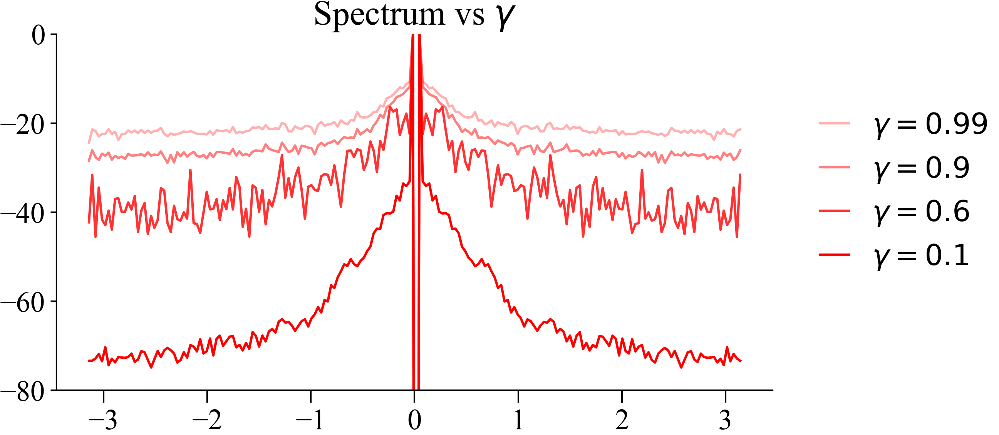

```python
def vi_by_horizon(rewards, dyn_mats, gamma=0.9, H=10):
    q_values = np.zeros(dyn_mats.shape[:2])

    for step in range(H):
        q_max = q_values.max(axis=0)
        q_values = rewards + gamma * (dyn_mats @ q_max)

    return q_values
```

Collect the spectrum from a collection of MDPs.

```python
for gamma, alpha in tqdm(zip([0.99, 0.9, 0.6, 0.1], [0.3, 0.5, 0.8, 1]), leave=False):
    centered_spectrum = 0
    for seed in trange(100):
        torch.manual_seed(seed)
        mdp = ToyMDP(seed=seed, k=20)

        states, rewards, dyn_mats = mdp.get_discrete_mdp(num_states=200)
        q_1, q_2 = vi_by_horizon(rewards, dyn_mats, gamma=gamma, H=100)

        spectrum = fft(q_1 / q_1.mean() - 1)
        centered_spectrum += fftshift(spectrum).__abs__()

    a = centered_spectrum / centered_spectrum.max()
    plt.plot(np.linspace(-np.pi, np.pi, 200), 10 * np.log(a), label=f"$\gamma={gamma}$", color="red",
             alpha=alpha)
    logger.save_pkl({gamma: centered_spectrum}, path="data/spectrum_gamma.pkl", append=True)

plt.legend(frameon=False, loc=(1.05, 0.3))
doc.savefig(f'{Path(__file__).stem}/toy_mdp_spectrum_vs_gamma.png')
plt.title("")  # remove title in PDF for use in LaTeX
plt.savefig(f'{Path(__file__).stem}/toy_mdp_spectrum_vs_gamma.pdf')
```


