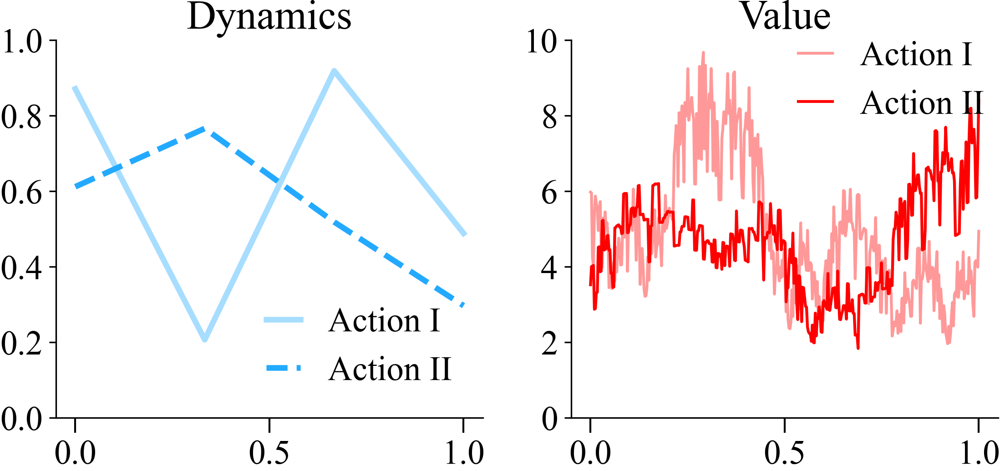

```python
def vi_by_horizon(rewards, dyn_mats, gamma=0.9, H=10):
    q_values = np.zeros(dyn_mats.shape[:2])

    for step in trange(H, desc="value iteration"):
        q_max = q_values.max(axis=0)
        q_values = rewards + gamma * (dyn_mats @ q_max)

    return q_values
```

Collect the spectrum from a collection of MDPs.

```python
seed = 5
torch.manual_seed(seed)
mdp = ToyMDP(seed=seed, n=4)

states, rewards, dyn_mats = mdp.get_discrete_mdp(num_states=400)
q_1, q_2 = vi_by_horizon(rewards, dyn_mats, gamma=0.9, H=200)

plt.figure(figsize=(8, 4))
plt.subplot(121)
plt.title('Dynamics')
plt.plot(mdp.kinks, mdp.nodes[0], color="#23aaff", alpha=0.4, linewidth=3, label="Action I")
plt.plot(mdp.kinks, mdp.nodes[1], color="#23aaff", linestyle="--", linewidth=3, label="Action II")
plt.legend(loc='lower right', handlelength=1)
plt.ylim(0, 1)

plt.subplot(122)
plt.title('Value')
plt.plot(states, q_1, color="red", alpha=0.4, linewidth=1.5, label="Action I")
plt.plot(states, q_2, color="red", linewidth=1.5, label="Action II")
plt.ylim(0, 10)
plt.legend(loc=(0.5, 0.75), handlelength=1)
plt.tight_layout()
doc.savefig(f'{Path(__file__).stem}/toy_mdp_{seed}.png')
# plt.title("")  # remove title in PDF for use in LaTeX
plt.savefig(f'{Path(__file__).stem}/toy_mdp_{seed}.pdf')
```


