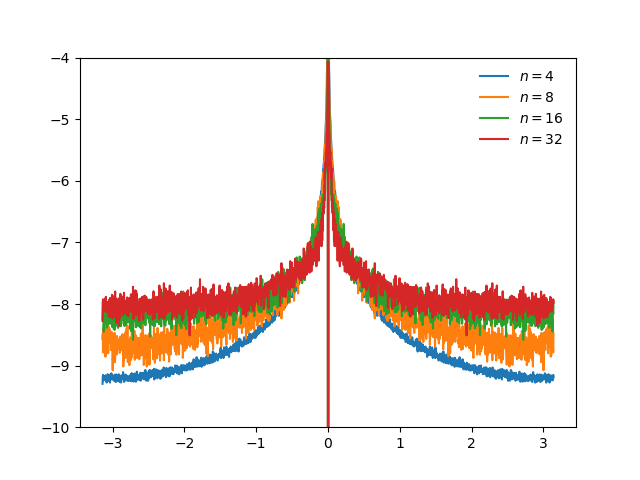

```python
def vi_by_horizon(rewards, dyn_mats, gamma=0.9, H=10):
    q_values = np.zeros(dyn_mats.shape[:2])

    for step in range(H):
        q_max = q_values.max(axis=0)
        q_values = rewards + gamma * (dyn_mats @ q_max)

    return q_values
```

Collect the spectrum from a collection of MDPs.

```python
for kinks in tqdm([4, 8, 16, 32], leave=False):
    centered_spectrum = 0
    for seed in trange(20, leave=False):
        torch.manual_seed(seed)
        mdp = ToyMDP(seed=seed, n=kinks)

        states, rewards, dyn_mats = mdp.get_discrete_mdp(num_states=2000)
        q_1, q_2 = vi_by_horizon(rewards, dyn_mats, gamma=0.9, H=10)
        spectrum = fft(q_1 / q_1.mean() - 1)
        centered_spectrum += fftshift(spectrum).__abs__()

    a = centered_spectrum / centered_spectrum.sum()
    a = np.log(a)
    plt.plot(np.linspace(-np.pi, np.pi, len(a)), a, label=f"$n={kinks}$")

plt.ylim(-10, -4)
plt.hlines(0, -np.pi, np.pi, 'gray', linestyles='--', linewidth=3)
plt.legend(frameon=False)
doc.savefig(f'{Path(__file__).stem}/toy_mdp_value_spectrum{seed}.png')
```


