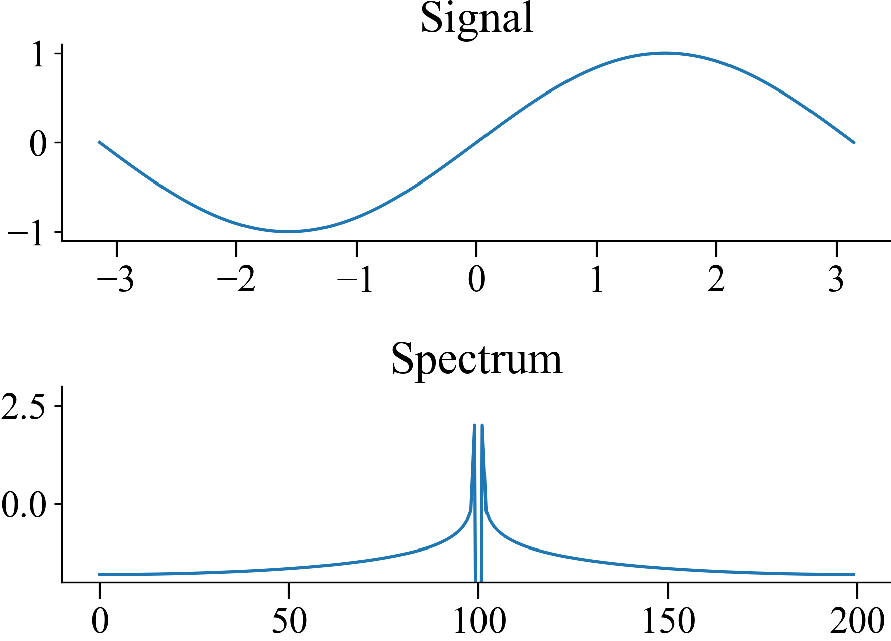
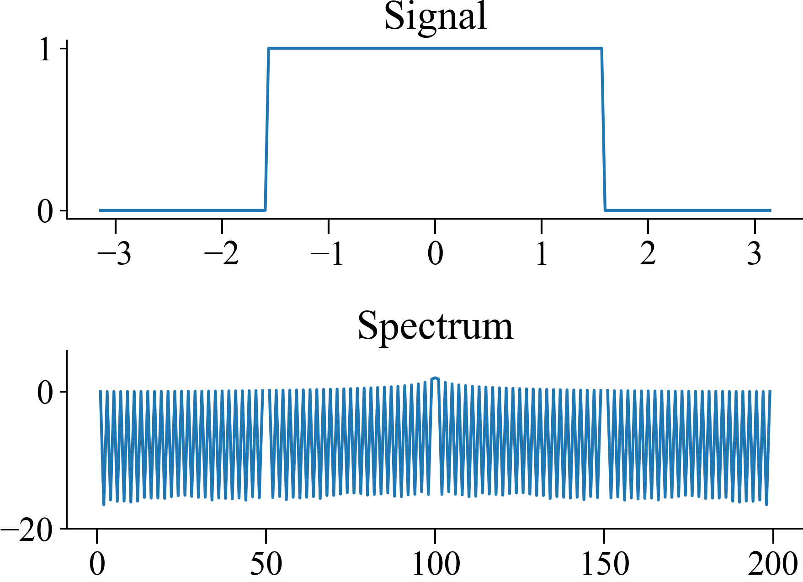

# The Windowing Effect of Finite Horizon FFT

The fourier transform of a sine function in a finite sampling window
has this roll-off due to the sampling window.

```python
xs = np.linspace(-np.pi, np.pi, 200)
ys = np.sin(xs)

spectrum = fft(ys)
spectrum = fftshift(spectrum)
a = spectrum.__abs__()

plt.figure()
plt.subplot(2, 1, 1)
plt.title('Signal')
plt.plot(xs, ys)
plt.subplot(2, 1, 2)
plt.title('Spectrum')
plt.plot(np.log10(a))
plt.ylim(-2, 3)
```



This is called the leakage.  

```python
xs = np.linspace(-np.pi, np.pi, 200)
ys = np.zeros(200)
ys[50:-50] = 1

spectrum = fft(ys)
spectrum = fftshift(spectrum)

plt.figure()
plt.subplot(2, 1, 1)
plt.title('Signal')
plt.plot(xs, ys)
plt.subplot(2, 1, 2)
plt.title('Spectrum')
plt.plot(np.log10(spectrum.__abs__()))
plt.ylim(-20, 6)
```

