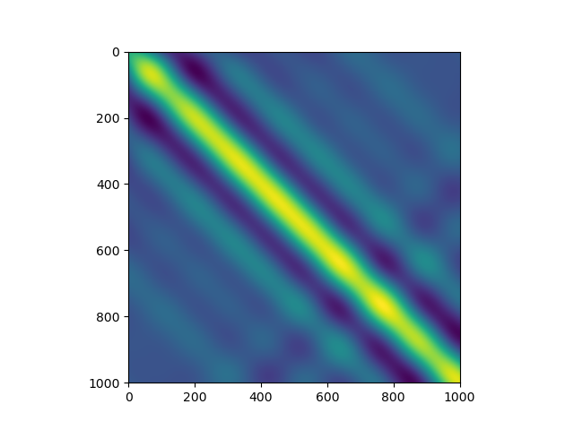
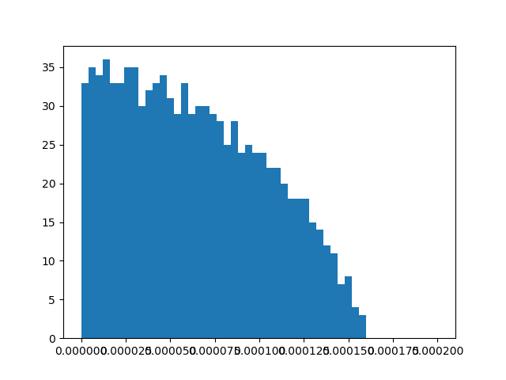

# Spectral Signature of Neural Kernels

Instantiate a simple 1-layer neural network and bunch of data

```python
import numpy as np
import torch
from torch import nn


class LFF(nn.Module):
    """
    get torch.std_mean(self.B)
    """

    def __init__(self, in_features, mapping_size, scale=1.0):
        super().__init__()
        self.input_dim = in_features
        self.output_dim = mapping_size
        self.linear = nn.Linear(in_features, self.output_dim)
        nn.init.uniform_(self.linear.weight, - scale / self.input_dim, scale / self.input_dim)
        nn.init.uniform_(self.linear.bias, -1, 1)

    def forward(self, x):
        x = self.linear(np.pi * x)
        return torch.sin(x)


class RFF(LFF):
    def __init__(self, input_dim, mapping_size, scale=1):
        super().__init__(input_dim, mapping_size, scale=scale)
        self.linear.requires_grad = False


# @torch.no_grad()
class RFFMLP(nn.Sequential):
    def __init__(self, in_features, in_scale, latent_features, latent_layers, out_features):
        self.in_features = in_features
        self.latent_features = latent_features
        self.latent_layers = latent_layers
        self.out_features = out_features

        assert latent_layers >= 1

        layers = [
            RFF(in_features, latent_features, scale=in_scale)
        ]
        for in_dim, out in zip([latent_features] * latent_layers,
                               [latent_features] * (latent_layers - 1) + [out_features]):
            layers += [
                nn.Linear(in_dim, out),
                nn.ReLU()
            ]

        super().__init__(*layers[:-1])
```
create the data between $\mathbb R_{[0, 1)}$
```python
xs = np.linspace(0, 1, 1001)[:, None]
# mlp = RFFMLP(1, 100, 400, 1, 100)
mlp = RFF(1, mapping_size=100, scale=10)
```

We can visualize the *gram matrix*: 

```python
import matplotlib.pyplot as plt

xs = torch.FloatTensor(xs)
zs = mlp(xs).numpy()

gram_matrix = zs @ zs.T

plt.imshow(gram_matrix)
doc.savefig(f"{Path(__file__).stem}/gram_matrix.png")
plt.close()
```



Now visualize the spectral structure

```python
def get_spectrum(gram_matrix):
    # u = v.T b/c gram_matrix is hermitian.
    u, energy, v = np.linalg.svd(gram_matrix)
    return energy


e = get_spectrum(gram_matrix)
plt.hist(e, bins=50, range=[0, 2.e-4])

doc.savefig(f"{Path(__file__).stem}/spectrum.png")
```



Now we can visualize its *conjugate kernel*


Now we can visualize its *neural tangent kernel*
