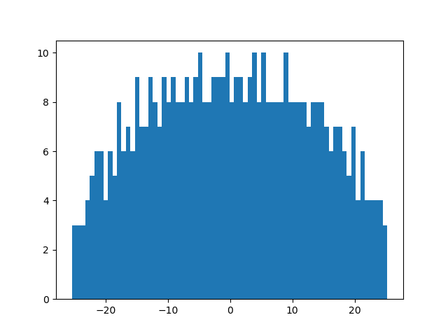

```python
N = 500
A = np.random.uniform(-1, 1, (N, N))
eigenvalues = np.linalg.eigvalsh(A)
```
```python
doc.print(max(eigenvalues), min(eigenvalues))
```

```
25.26513047782818 -25.456970969297966
```
```python
plt.hist(eigenvalues, bins=70)
doc.savefig(f"{Path(__file__).stem}/wigner_circular_law.png")
```


