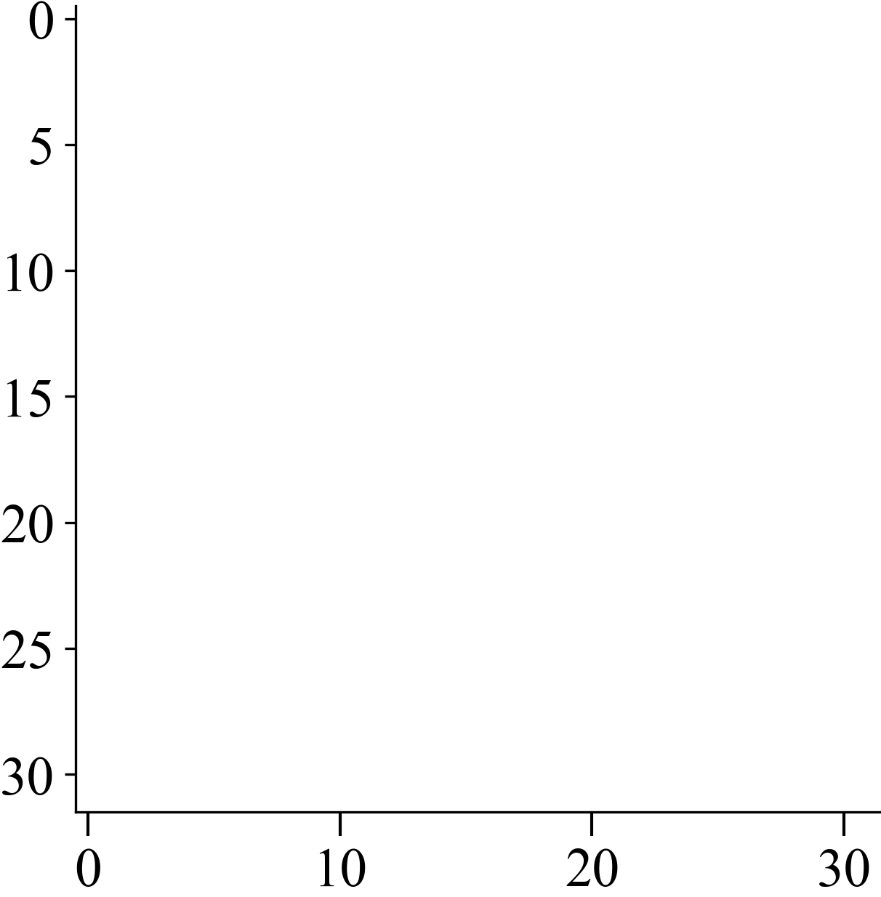
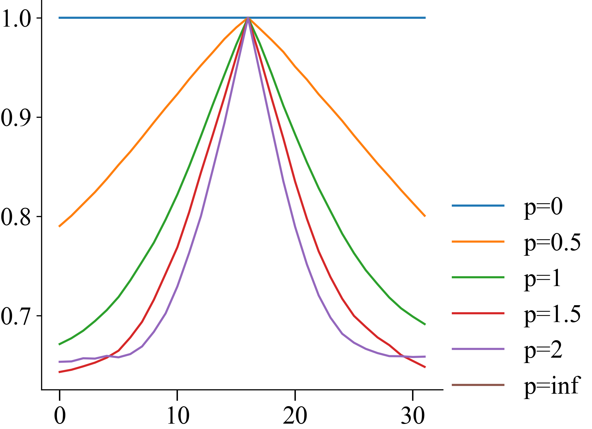
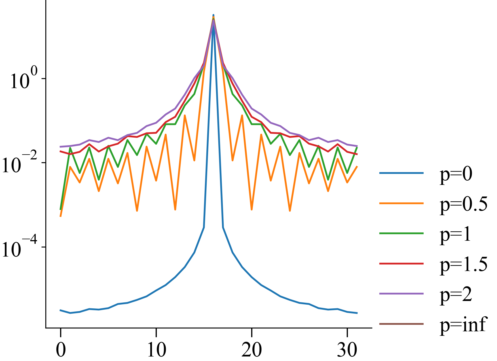

# Reproducing NTK kernel of the Fourier Features

This notebook uses the `simple_ntk` module available in this directory
to reproduce Fig 2. from the paper

[^fourier]: 


```python
xs = np.linspace(-0.5, 0.5, 32)

for p in tqdm([0, 0.5, 1, 1.5, 2, float("inf")], desc="kernels"):
    # average from five networks
    ntk_kernel = 0
    for i in trange(10, desc="averaging networks", leave=False):
        net = nn.Sequential(
            RFF(1, 32, p),
            MLP(32, 1024, 4, 1),
        )
        ntk_kernel += 0.1 * get_ntk(net, xs)

    plt.figure("cross section")
    plt.plot(ntk_kernel[16], label=f"p={p}")

    plt.figure("spectrum")
    fft = np.fft.fft(ntk_kernel[16])
    plt.plot(np.fft.fftshift(fft).__abs__(), label=f"p={p}")
```
```python
plt.imshow(ntk_kernel, cmap="inferno")
```
| **Kernel** | **Cross Section** | **Spectrum** |
|:----------:|:-----------------:|:------------:|
|  |  |  |
