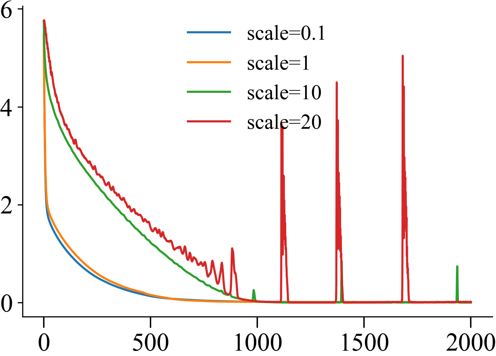

## Learned Fourier Features

We use stacked, four-layer Learned Fourier Networks (LFN) to fit to a complex value function.

The figure table below shows that with correct scaling, the spectral bias persist across networks
of different width across 8 octaves of latent dimension.

```python
num_states = 200
torch.manual_seed(0)
mdp = RandMDP(seed=0, option='fixed')
states, rewards, dyn_mats = mdp.get_discrete_mdp(num_states=num_states)
q_values, losses = perform_vi(states, rewards, dyn_mats)
```
|  |  |
|:-----------------------------------------------------------------------------------------------------------------------------------------------------------------------------------------------------:|:----------------------------------------------------------------------------------------------------------------------------------------------------------------------------------------------------------:|


# Supervised Learning with Learned Random Fourier Features (LFF)

The random matrix simply does not update that much!

```python
for dim, n_epochs in zip([24, 50, 100, 200, 400, 800, 1600], [4000, 2000, 500, 250, 100, 100, 100]):
    r = table.figure_row()
    all_losses = {}
    for scale in [0.1, 1, 10, 20]:
        q_values, losses, B_stds, B_means = supervised_lff_mlp(states, gt_q_values, B_scale=8,
                                                               n_epochs=n_epochs, latent_dim=dim,
                                                               latent_scale=scale)
        plt.figure('losses')
        plt.plot(losses, label=f"scale={scale}")

        plt.figure(f'scale {scale}')
        plt.plot(states, q_values[0], label="action 1")
        plt.plot(states, q_values[1], label="action 2")
        r.savefig(os.path.basename(__file__)[:-3] + f"/supervised_lff_mlp_dim-{dim}_sig-{scale}.png",
                  title=f"dim={dim} $\sigma={scale}$" if scale == 0.1 else f"$\sigma={scale}$")
        plt.close()

    plt.figure('losses')
    plt.legend(frameon=False)
    r.savefig(os.path.basename(__file__)[:-3] + f"/supervised_lff_mlp_loss_dim-{dim}_sig-{scale}.png")
    plt.close()
```

| **dim=24 $\sigma=0.1$** | **$\sigma=1$** | **$\sigma=10$** | **$\sigma=20$** |   |
|:-----------------------:|:--------------:|:---------------:|:---------------:|:-:|
|  |  |  |  |  |
| **dim=50 $\sigma=0.1$** | **$\sigma=1$** | **$\sigma=10$** | **$\sigma=20$** |   |
|  |  |  |  |  |
| **dim=100 $\sigma=0.1$** | **$\sigma=1$** | **$\sigma=10$** | **$\sigma=20$** |   |
|  |  |  |  |  |
| **dim=200 $\sigma=0.1$** | **$\sigma=1$** | **$\sigma=10$** | **$\sigma=20$** |   |
|  |  |  |  |  |
| **dim=400 $\sigma=0.1$** | **$\sigma=1$** | **$\sigma=10$** | **$\sigma=20$** |   |
|  |  |  |  |  |
| **dim=800 $\sigma=0.1$** | **$\sigma=1$** | **$\sigma=10$** | **$\sigma=20$** |   |
|  |  |  |  |  |
| **dim=1600 $\sigma=0.1$** | **$\sigma=1$** | **$\sigma=10$** | **$\sigma=20$** |   |
|  |  |  |  |  |

## DQN w/ LFF

Here we plot the value function learned via deep Q Learning (DQN) using a learned random
fourier feature network.

```python
q_values, losses, B_stds, B_means = perform_deep_vi_lff_mlp(states, rewards, dyn_mats, B_scale=8, n_epochs=100)
```
|  |  |  |  |
|:-------------------------------------------------------------------------------------------------------------------------------------------------------------------------------------------------:|:------------------------------------------------------------------------------------------------------------------------------------------------------------------------------------------------------:|:--------------------------------------------------------------------------------------------------------------------------------------------------------------------------------------------------------:|:------------------------------------------------------------------------------------------------------------------------------------------------------------------------------------------------------:|
